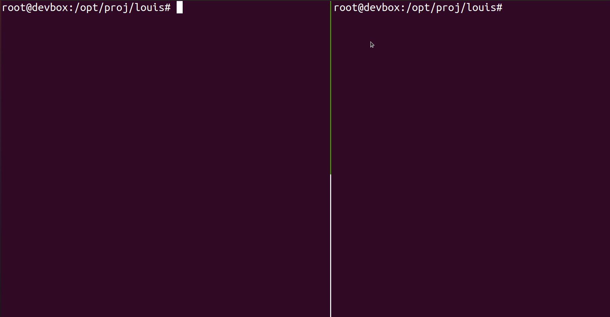

 # Alertyx

`Alertyx` is a powerful tool designed to automatically detect and respond to malicious behavior on a Linux system using eBPF. This README provides an overview of the project, including setup instructions, usage guidelines, and credits.

## Table of Contents
- [Features](#features)
- [Installation](#installation)
- [Usage](#usage)
- [Project Structure](#project-structure)
- [Screenshots & Examples](#screenshots--examples)
- [Future Activities](#fun-future-activities)
- [Prior Art](#prior-art)
- [eBPF Resources and Libraries](#ebpf-resources-and-libraries)
- [Contributing](#contributing)
- [Credits](#credits)
- [License](#license)

## Features
- 🛠️ **Analysis**: Comprehensive tools to analyze system events.
- 🚀 **Correlation**: Advanced correlation capabilities to identify patterns.
- 📊 **Output**: Various output formats for easy integration with other tools.
- 📚 **Documentation**: Detailed documentation to guide you through the setup and usage.
- 🔍 **Hunt**: Hunt for existing malicious activity.
- 🛡️ **Mitigation**: Mitigate all known vulnerabilities.
- 🕵️‍♂️ **Monitoring**: Actively monitor for malicious actions.

## Installation

1. Ensure [BCC](https://github.com/iovisor/bcc) is installed.
2. Install `alertyx`:
    - Clone this repository and build the binary (requires Go):
        ```bash
        git clone https://github.com/sourque/alertyx
        cd alertyx
        go build
        ```
    - Or download the `alertyx` binary from releases.

## Usage

```txt
Usage:
  alertyx [command]

Available Commands:
  help        Help about any command
  hunt        Hunt for existing malicious activity
  mitigate    Mitigate all known vulnerabilities
  monitor     Actively monitor for malicious action
  version     Print alertyx version

Flags:
  -a, --active    Counter detected malicious activity (dangerous, may clobber)
  -h, --help      Help for alertyx
  -s, --syslog    Output to syslog
  -v, --verbose   Enable verbose output

Use "alertyx [command] --help" for more information about a command.
```

## Information

`alertyx` gathers information from the kernel through eBPF (with BCC). These sources are analyzed with information from categorized techniques and vulnerabilities.

```txt
                                                +------------+
                                                |            |
                                                | CLI Output |
                                                |            |
                                                +--------+---+
                                                         ^
                   +-------------------------------------|------+
                   |                                     |      |
+--------+         | +---------+    +----------+     +---+---+  |
|        |         | |         |    |          +---->+       |  |
|        |   eBPF  | | Sources +--->+ Analysis |     | alertyx |  |
| Kernel +---------->+ Sockets |    +----------+     +--+----+  |
|        |         | | Users   |               ^        ^       |
|        |         | | Proc... |    +-------+  |        |       |
|        |         | |         |    |       |  |        v       |
+--------+         | +---------+    | Techs +<-+    +---+----+  |
                   |                |       |       | Output |  |
                   |                +-------+       +--------+  |
                   |                                            |
                   +--------------------------------------------+
```

> There is no kernelspace component (other than the eBPF data-gathering code), which means `alertyx` is more susceptible to resource exhaustion and various types of executable manipulation. However, if that happens, you'll probably know about it.

## Project Structure
- **analysis/**: Tools and scripts for event analysis.
- **cmd/**: Command-line interface components.
- **common/**: Common utilities and helpers.
- **correlate/**: Event correlation logic.
- **docs/**: Project documentation.
- **events/**: Event definitions and handlers.
- **output/**: Output format definitions and handlers.
- **system/**: System-level utilities.
- **techs/**: Technology-specific components.
- **utils/**: General utilities.

## Screenshots & Examples



## Fun Future Activities

- **New Sources**:
    - eBPF additions
    - PAM authentication
    - File permission changes (for sensitive dirs like /tmp and creating new bins/suid/sgid)
- **Techs/Threat Actions**:
    - Send lines per <time unit> (bash)
    - Time between shell spawn and sending commands (maybe)
    - Connect() (detect if being scanned)
- **Fixes**:
    - Pwd incorrectly reports absolute path when in mounted/chrooted environment (e.g., tmux)
    - Race condition in BCC code? Imagine one open syscall on the same PID starts before another and ends after -- details would be overwritten?

## Prior Art

- [Falco](https://github.com/falcosecurity/falco): Well-made tool with a similar purpose and design, primarily in C++, large backing by Sysdig.
- [BLUESPAWN](https://github.com/ION28/BLUESPAWN): Similar tool for Windows, made by very talented and welcoming developers.
- [PeaceMaker](https://github.com/D4stiny/PeaceMaker): Windows heuristic monitoring tool made by a local cyber genius.

## eBPF Resources and Libraries

- [iovisor/gobpf](https://github.com/iovisor/gobpf)
- [iovisor/bcc](https://github.com/iovisor/bcc)
- [Brendan Gregg's BCC Tracing Tools](http://www.brendangregg.com/Perf/bcc_tracing_tools.png)

## Contributing
We welcome contributions from the community! Please read our [contributing guide](CONTRIBUTING.md) to get started.

## Credits
This project is forked from the original [Alertyx](https://github.com/original/alertyx) project by [Original Author](https://github.com/originalauthor). We thank them for their amazing work and the foundation they provided.

## License
Alertyx is licensed under the [MIT License](LICENSE).

---

Made with ❤️ by [Your Name](https://github.com/yourusername)

---

If you have any questions or need further assistance, please open an issue or contact us directly. Happy monitoring! 📈
